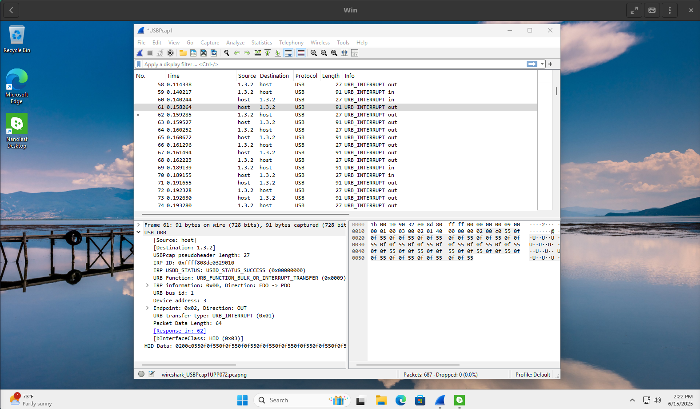

+++
title = "Using Wireshark to reverse-engineer a USB device"
description = "To develop our own drivers for a USB device, we must first learn how it actually works. Luckily, Wireshark can help out here."
date = 2025-06-18
draft = true

[taxonomies]
categories = ["wireshark", "windows", "usb", "linux", "nanoleaf-saga"]
+++

A couple of months ago I bought the [Nanoleaf Pegboard Desk Dock](https://nanoleaf.me/en-EU/products/pegboard-desk-dock/?size=1), the latest and greatest in USB-hub-with-RGB-LEDs-and-hooks-for-gadgets technology. This invention unfortunately only supports the *real gamer* operating systems of Windows and macOS, which necessitated the development of a Linux driver.

Previously, I [set up a Windows VM](../windows-vm-nixos/) for the purposes of reverse-engineering the protocol used by this device, which was frankly way more complicated than it needed to be. Today we're going to actually set up the tracing and see what we can glean from a cursory look.

---

The first thing we want to do is to set up the official drivers on the VM and just confirm that the USB passthrough works. In my case, this included setting up the Nanoleaf app, passing through the actual device through Boxes settings, setting up the device within the app, and making sure I can change the colors and set up custom scenes on the device.

The next step is to see what is the app actually doing when it instructs the device to change colors. Searching for "monitor USB traffic" will give you a bunch of results, some of which look a bit suspicious. After a couple of minutes of looking around, I discovered that the venerable [Wireshark has support for USB capture](https://wiki.wireshark.org/CaptureSetup/USB). 

There are two options for installing Wireshark:

1. You could set it up on the host machine. This means setting up Wireshark globally. You'll get all traffic from all devices you currently have plugged in, which might be noisy. Also, I discovered that, at least on my scuffed NixOS setup, the passthrough might mess somewhat with the tracing.
2. You could set it up on the guest machine. This means you have to set up Wireshark on Windows. You'll get traffic from only the devices you pass through to the guest machine. However, people online seem to have had troubles with it in the past.

I set up both, but ultimately I found that the second option was more useful to me, as monitoring the traffic that was being passed through was not always giving me good results. On the other hand, if you have trouble with the Windows version, you can always try setting it up on the host.

## Setting up Wireshark on NixOS

Add the following to your `configuration.nix`:

```nix
# Enable Wireshark with USB support
programs.wireshark = {
    enable = true;
    package = pkgs.wireshark; # otherwise you get the CLI version
    usbmon.enable = true; # enable USB capture
    dumpcap.enable = true; # enable network capture
};

# Add your user account to the Wireshark group
users.groups.wireshark.members = [ "your-username-here" ];
```

Wireshark won't work if set up via `home-manager` - it needs to be installed globally. You might need to log out and log back in to your system for the group changes to take effect.

## Setting up Wireshark on Windows

Besides [Wireshark itself](https://www.wireshark.org/), you will also need to install [USBPcap](https://desowin.org/usbpcap/) which enables the USB packet capture on Windows. Make sure to follow their [Illustrated Tour](https://desowin.org/usbpcap/tour.html), as you'll have to manually copy the `USBPcapCMD.exe` executable into the Wireshark plugins directory. However, once you've done that, it's fairly smooth sailing.

This will likely require a reboot of the VM, which will also release the USB passthrough on the device. This is actually convenient as it lets us record the entire communication between the drivers and the device.

## Capturing packets

Regardless of whether you're running Wireshark on Windows or Linux, once I set it up, I could:

1. open the Nanoleaf Desktop app
2. open Wireshark and start recording
3. "plug in" the device by going to Preferences in Boxes and enabling the passthrough in the "Devices & Shares" tab
4. change the color via the Nanoleaf Desktop app to something simple. I used a calming, static green color.

This fills Wireshark with a deluge of packets flowing between the host and the device. It looks a bit like this:



Since there are a **ton** of packets, what I want to do now is to narrow down the scope to something more reasonable for us to analyze. Let's look for patterns!

## Finding patterns

As you can tell by the `Time` column, a new set of packets was sent out about every 20 milliseconds. These seem to be something called `URB_INTERRUPT`, and it seems like there is a consistent pattern of 8 packets out, then 2 packets in, with 4 of those "out" packets going from the host to the device. What I'm thinking now is that I can probably ignore the "response" packets and just focus on the ones with data inside, as that's probably what I'm going to be working with.

Each packet going from the host to the device seems to have some sort of a header, then a chunk of "HID Data".  Looking at the first packet in a set, the "HID Data" block looks like this:

```
0000   02 00 c0 55 0f 0f 55 0f 0f 55 0f 0f 55 0f 0f 55   ...U..U..U..U..U
0010   0f 0f 55 0f 0f 55 0f 0f 55 0f 0f 55 0f 0f 55 0f   ..U..U..U..U..U.
0020   0f 55 0f 0f 55 0f 0f 55 0f 0f 55 0f 0f 55 0f 0f   .U..U..U..U..U..
0030   55 0f 0f 55 0f 0f 55 0f 0f 55 0f 0f 55 0f 0f 55   U..U..U..U..U..U
```

Looking at the next packet sent from the host to the device in the sequence, we see this:

```
0000   0f 0f 55 0f 0f 55 0f 0f 55 0f 0f 55 0f 0f 55 0f   ..U..U..U..U..U.
0010   0f 55 0f 0f 55 0f 0f 55 0f 0f 55 0f 0f 55 0f 0f   .U..U..U..U..U..
0020   55 0f 0f 55 0f 0f 55 0f 0f 55 0f 0f 55 0f 0f 55   U..U..U..U..U..U
0030   0f 0f 55 0f 0f 55 0f 0f 55 0f 0f 55 0f 0f 55 0f   ..U..U..U..U..U.
```

Moving on to the last 2 packets, the pattern continues:

```
0000   0f 55 0f 0f 55 0f 0f 55 0f 0f 55 0f 0f 55 0f 0f   .U..U..U..U..U..
0010   55 0f 0f 55 0f 0f 55 0f 0f 55 0f 0f 55 0f 0f 55   U..U..U..U..U..U
0020   0f 0f 55 0f 0f 55 0f 0f 55 0f 0f 55 0f 0f 55 0f   ..U..U..U..U..U.
0030   0f 55 0f 0f 55 0f 0f 55 0f 0f 55 0f 0f 55 0f 0f   .U..U..U..U..U..

0000   55 0f 0f 00 00 00 00 00 00 00 00 00 00 00 00 00   U...............
0010   00 00 00 00 00 00 00 00 00 00 00 00 00 00 00 00   ................
0020   00 00 00 00 00 00 00 00 00 00 00 00 00 00 00 00   ................
0030   00 00 00 00 00 00 00 00 00 00 00 00 00 00 00 00   ................
```

Finally, the device sends us something back:

```
0000   82 00 01 00 00 00 00 00 00 00 00 00 00 00 00 00   ................
0010   00 00 00 00 00 00 00 00 00 00 00 00 00 00 00 00   ................
0020   00 00 00 00 00 00 00 00 00 00 00 00 00 00 00 00   ................
0030   00 00 00 00 00 00 00 00 00 00 00 00 00 00 00 00   ................
```

To get some extra data, let's try changing the color in the Nanoleaf app from a dark green to a bright red (`#FF0000`). This shows us the following packet flowing out:

```
0000   02 00 c0 0f ff 0f 0f ff 0f 0f ff 0f 0f ff 0f 0f   ................
0010   ff 0f 0f ff 0f 0f ff 0f 0f ff 0f 0f ff 0f 0f ff   ................
0020   0f 0f ff 0f 0f ff 0f 0f ff 0f 0f ff 0f 0f ff 0f   ................
0030   0f ff 0f 0f ff 0f 0f ff 0f 0f ff 0f 0f ff 0f 0f   ................
```

## Figuring out the protocol

Okay, so I think I can see what's going on here. There's a "header" of `02 00 c0`, followed by 192 bytes of what looks like color data. This tracks with 64 RGB LEDs, as `192 bytes / 64 LEDs = 3 bytes per LED`.  Moreover, `c0` in hexadecimal is 192 in decimal, so what we are likely seeing here is some sort of a command code, followed by expected length of the body, followed by the actual data - a [Type-length-value](https://en.wikipedia.org/wiki/Type%E2%80%93length%E2%80%93value) format, one might say.

After those 4 packets are sent and acknowledged, the device will send us a packet with `82 00 01` and no further data. This is probably some sort of a confirmation packet that we can ignore for now.


The USB protocol tends to use the first bit of a byte to denote whether an endpoint or a message is going from the host to the device (in which case it's set to `0`), or from the device to the host (in which case it's set to `1`). Knowing that, we could assume that `0x82` is probably a response tag to the `0x02` command.



What messes my logic up is the data itself. For example, if I set the color to static red, the pattern I see is `0f ff 0f`, when I'd expect `ff 00 00`. Same with my first dark green setting - I get `55 0f 0f` when I'd expect `00 55 00`. It looks like the red and green bytes are rotated for some reason, so in essence we get GRB instead of RGB. That does not explain why LEDs that are supposed to be "off" get set to `0f`.

More confusion arises when turning the light completely off, or setting it to pure white. In those cases, we get `0f 0f 0f` and `d7 ff a1` respectively. Funnily enough, setting the device to pure white also breaks it and forces it to reset even if done through official drivers.

I spent a lot of time trying to figure out what's the logic behind this - at some point I thought it might even be [gamma correction](https://en.wikipedia.org/wiki/Gamma_correction), even though that ended up not making any sense at all. My assumption here is that there are some device limitations here that the driver tries to mitigate but does not fully succeed. We can worry about that later, though.

## The results

Right now we have a general idea of what to do in order to replicate the official app's "solid color" feature:

- The first byte is `0x02`, likely indicating the type of the message we're sending.
- Follow up with two bytes describing the length of the message. We have 64 LEDs, so we want to send 64 x 3 = 192 bytes, or `0xc0` bytes.
- Follow up with 192 bytes describing the colors of the LEDs, in green-red-blue format.
- The device will respond with `0x82` indicating some sort of a success response, followed by a two-byte field set to `0x01`.

Fairly simple and non-revolutionary. When I started, I was somewhat afraid that the protocol would involve some weird proprietary image format or invoke subroutines on the device itself that I could not decipher, but all things considered, this was fairly reasonable.

I imagine that, if you do this with a more complicated device, like a mouse, you would have a significantly harder time deciphering it. However, applying the same process of recording packets, changing one variable in isolation (for example, moving the mouse slightly up), noting what changed, changing another variable in isolation and so on would likely lead you to the same conclusion. Or you could just, you know, [read the spec for a generic mouse protocol](https://wiki.osdev.org/USB_Human_Interface_Devices).

Either way, this is hopefully enough to write a simple implementation that opens up the device and writes to it... Somehow. And after I write this implementation, I could cycle through each green-red-blue set, turning it on one at a time, to see exactly how the LEDs are laid out in the chassis and what is the order that I need to send them in to achieve more complex patterns. How exactly is that going to happen remains a mystery, though. Cliffhanger!
